<div align="center">


[](https://docs.microsoft.com/en-us/dotnet/csharp/)
[](https://visualstudio.microsoft.com/)
[](https://dotnet.microsoft.com/en-us/download/dotnet/8.0)
[](https://github.com/dotnet/wpf)
[](https://firebase.google.com/)

*A modern, intelligent dictionary and translation application for Windows, built with WPF and Firebase Cloud Sync* 🚀

[Key Features](#-key-features) • [Tech Stack](#-tech-stack) • [Installation](#-installation) • [Team](#-team-members)

</div>

## 📖 Project Overview

LexiScan is an innovative desktop translation tool developed to help users learn languages efficiently. Unlike traditional dictionaries, LexiScan offers instant popup translations, smart vocabulary management, and real-time cloud synchronization, making it a perfect companion for reading and learning on Windows. This application developed by students at UIT (University of Information Technology, Vietnam National University - Ho Chi Minh City)

## 🛑 Disclaimer

**IMPORTANT NOTICE**: This application is a personal project developed for educational and portfolio purposes.

- The project is **Open Source**.
- It leverages free APIs (Google Translate) and Firebase Realtime Database (Test Mode).
- The project is discontinued
- It was created solely for academic purposes and is not intended for commercial distribution. The repository is archived and maintained for educational reference only.
- No further development or updates will be made. Therefore, no maintenance or bug fixes will be provided.
- Users should note that the app is not officially supported and may contain unaddressed issues. Not intended for production use.

## 📚 Academic Project

This project was developed as part of a course requirement at UIT.

### Academic Context
- **Course:** IT008.P11
- **Objective:** Demonstrate proficiency in **Windows Desktop application development** using **C#, .NET 8, and WPF**.

### Academic Integrity
- This project is for educational purposes.
- Not intended for commercial distribution.
- Developed as a practical application of **MVVM architecture**, **Cloud Integration**, and **Desktop UI Design principles**.

## ✨ Key Features

<div align="center">
  <table>
    <tr>
      <td width="25%" align="center">
        
        <br/>
        <b>Instant Translation</b>
        <br/>
        <sub>Select text anywhere to translate immediately with a floating popup.</sub>
      </td>
      <td width="25%" align="center">
        
        <br/>
        <b>Personal Dictionary</b>
        <br/>
        <sub>"Pin" words to your personal list and sync them to the cloud instantly.</sub>
      </td>
      <td width="25%" align="center">
        
        <br/>
        <b>Smart Text-to-Speech</b>
        <br/>
        <sub>Native pronunciation support for English with auto-read mode.</sub>
      </td>
      <td width="25%" align="center">
        
        <br/>
        <b>Dark & Light Theme</b>
        <br/>
        <sub>Seamlessly switch between Dark and Light modes to suit your preference.</sub>
      </td>
    </tr>
  </table>
</div>

## 📱 Screenshots

<div align="center">


&nbsp;&nbsp;&nbsp;


<br/>
<br/>


&nbsp;&nbsp;&nbsp;


  <p align="center">
    <sup><strong>Interface Preview:</strong> Login • Main app Dictionary • Popup Translation • Popup Translation choose word</sup>
  </p>
</div>

## 🛠 Tech Stack

<div align="center">

### Core Technologies

[](https://dotnet.microsoft.com/en-us/download/dotnet/8.0)


### Backend & Cloud


### Development Tools


</div>

## 🔌 Key Integrations & Libraries

### Material Design In XAML
We utilize the **MaterialDesignInXamlToolkit** to bring modern, Google-inspired UI components to the Windows desktop environment, ensuring a sleek and consistent user experience.

### Cloud Synchronization
Using **Firebase Realtime Database**, LexiScan ensures that your vocabulary list and history are safe and synchronized securely across sessions.

## 🎯 Project Architecture

```mermaid
graph TD
    classDef pastelPink fill:#ffdae9,stroke:#ffaad4,stroke-width:3px,color:#d63384,rx:20,ry:20;
    classDef pastelPurple fill:#e2d9ff,stroke:#c4b5fd,stroke-width:3px,color:#7c3aed,rx:20,ry:20;
    classDef pastelGreen fill:#d1fae5,stroke:#6ee7b7,stroke-width:3px,color:#059669,rx:20,ry:20;
    classDef pastelYellow fill:#fef3c7,stroke:#fcd34d,stroke-width:3px,color:#d97706,rx:20,ry:20;
    classDef pastelBlue fill:#dbeafe,stroke:#93c5fd,stroke-width:3px,color:#2563eb,rx:20,ry:20;
    
    classDef groupLabel fill:none,stroke:none,color:#b2bec3,font-size:14px,font-weight:bold;

    subgraph Presentation ["📱 Presentation Layer"]
        direction TB
        Toolkit([🎨 Material Design]):::pastelBlue
        View([🖥️ WPF Views]):::pastelPurple
    end

    subgraph Logic ["🧠 Application Logic"]
        VM([✨ ViewModels]):::pastelPink
    end

    subgraph Services ["🔧 Service Layer"]
        TS([🔤 Translate]):::pastelGreen
        DS([☁️ Database]):::pastelGreen
        TTS([📢 Text-to-Speech]):::pastelGreen
    end

    subgraph External ["🌍 External Systems"]
        GAPI{{🌐 Google API}}:::pastelYellow
        FB[("🔥 Firebase DB")]:::pastelYellow
        WS{{💻 Win Speech}}:::pastelYellow
    end
    Toolkit -.- View
    View <==> VM
    
    VM ==> TS
    VM ==> DS
    VM ==> TTS

    TS <--> GAPI
    DS <--> FB
    TTS --> WS

    class Presentation,Logic,Services,External groupLabel;
```


## 👥 Team Members

<div align="center">

| Role | Name | GitHub | Student ID |
|:---:|:---:|:---:|:---:|
| **🛠️ Project Leader & Fullstack Developer** | **Tịnh Văn** | [htvan-code](https://github.com/htvan-code) | 24521978 |
| **⚙️ Backend Developer** | **Thảo Uyên** |[24521965-coder](https://github.com/24521965-coder) | 24521965 |
| **🎨UI/UX Designer & Frontend Developer** | **Quốc Thịnh** | [qthinh1006](https://github.com/qthinh1006) | 24521692 |
| **🖥️ Popup Fullstack Developer** | **Kiều Vy** | [kieuvy611](https://github.com/kieuvy611)| 24522055 |
</div>

## 📦 Installation & Usage

### Option 1: Download & Run (For Users)
No coding skills required! Just download and use.

1. Go to the **[Releases](../../releases)** page of this repository.
2. Download the latest `LexiScan_v1.0.zip` file.
3. Extract the `.zip` file.
4. Open the folder and double-click **`LexiScan.exe`** to start.

> **Note:** If Windows warns about an "Unrecognized App" (SmartScreen), click **More Info** > **Run Anyway**.

---

### Option 2: Build from Source (For Developers)
If you want to modify the code or contribute to the project.

#### Requirements
- Visual Studio 2022.
- .NET 8.0 SDK.
- Git.

#### Steps
1. **Clone the Repository**
   Run the following commands in your terminal (Git Bash / PowerShell):
   ```bash
   git clone https://github.com/htvan-code/LexiScan-Automatic-Popup-Translator-Personalized-Dictionary.git
   cd LexiScan-Automatic-Popup-Translator-Personalized-Dictionary
2. **Open in Visual Studio**

  - Open LexiScan.sln.

3. **Restore & Run**

  - Right-click Solution > Restore NuGet Packages.
  - Press F5 to run in Debug mode.
## 📚 Learning Outcomes

This project provided valuable experience in:
- MVVM Architecture: Implementing clean code separation.
- WPF & XAML: Designing complex, responsive desktop UIs.
- Cloud Integration: Handling real-time data sync using Firebase.
- Asynchronous Programming: Mastering async/await for smooth UI.

## 📞 Contact

For academic inquiries or project details, please contact:
- Văn: htvan.se@gmail.com
- Uyên: 24521965@gm.uit.edu.vn
- Thịnh: qthinh1006@gmail.com
- Vy: nguyenvy13062013@gmail.com

---

<div align="center">
  <br>
  <a href="https://git.io/typing-svg">
    
  </a>

  <br><br> 
  
  <br>
  <p style="font-size: 10px; color: gray">© 2025 LexiScan Project</p>
</div>
